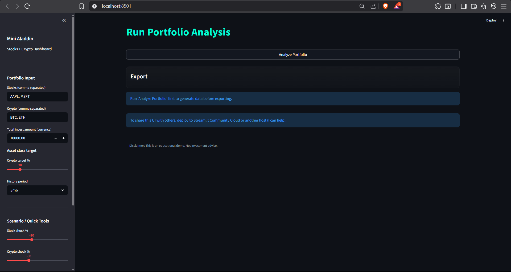
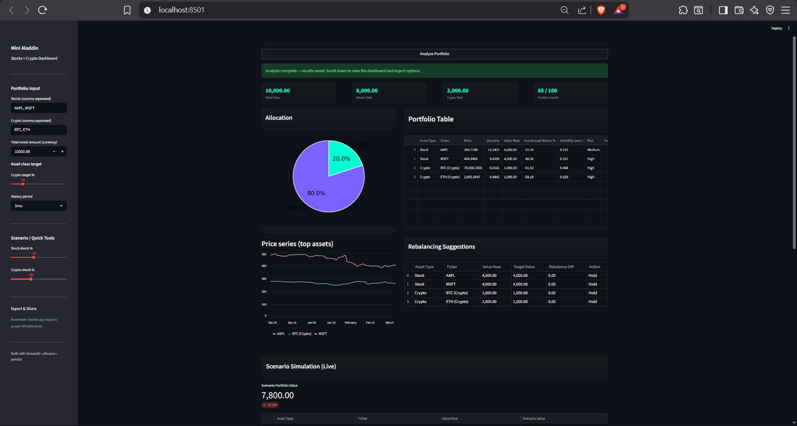

# mini-aladdin-portfolio-analysis
Mini Aladdin Portfolio Analysis Dashboard built with Python

# Mini Aladdin – Portfolio Analysis Dashboard

# Overview
Mini Aladdin is a Python-based portfolio analytics dashboard inspired by institutional portfolio management systems such as BlackRock’s Aladdin.

The project demonstrates how financial datasets can be analyzed and visualized through an interactive dashboard interface built with Python.

The dashboard allows users to explore portfolio composition, asset allocation, and portfolio insights using data-driven visualizations.

# Features
- Portfolio performance visualization
- Asset allocation analysis
- Portfolio analytics insights
- Interactive dashboard UI
- Financial data visualization

# Tech Stack
- Python
- Pandas
- NumPy
- Plotly
- Streamlit
- Matplotlib
- XlsxWriter

# Dependencies
Install the required Python libraries before running the application.

pip install streamlit pandas numpy plotly matplotlib xlsxwriter

Libraries used in this project:
- streamlit
- pandas
- numpy
- plotly
- matplotlib
- xlsxwriter

# Project Structure
mini-aladdin-portfolio-analysis/

app.py – main dashboard application  
assets/ – UI elements and visuals  
README.md – project documentation  

# Installation

## Clone the repository
git clone https://github.com/aps-waan/mini-aladdin-portfolio-analysis.git

## Navigate to the project directory
cd mini-aladdin-portfolio-analysis

## Install dependencies
pip install streamlit pandas numpy plotly matplotlib xlsxwriter

## Run the dashboard
streamlit run app.py

# Dashboard Preview

# Purpose
This project was built as part of a data analytics portfolio to demonstrate:

- portfolio analytics concepts
- financial data visualization
- dashboard development using Python
- interactive data analysis tools

# Future Improvements
- portfolio risk decomposition
- factor exposure analysis
- portfolio optimization models
- scenario stress testing tools

# Author
APS Waan

LinkedIn  
www.linkedin.com/in/aps-waan
